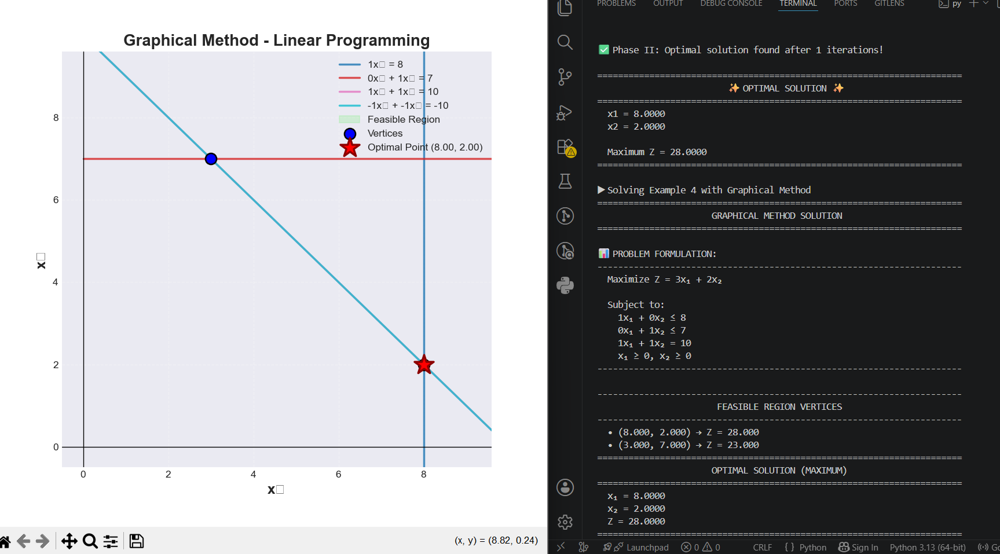
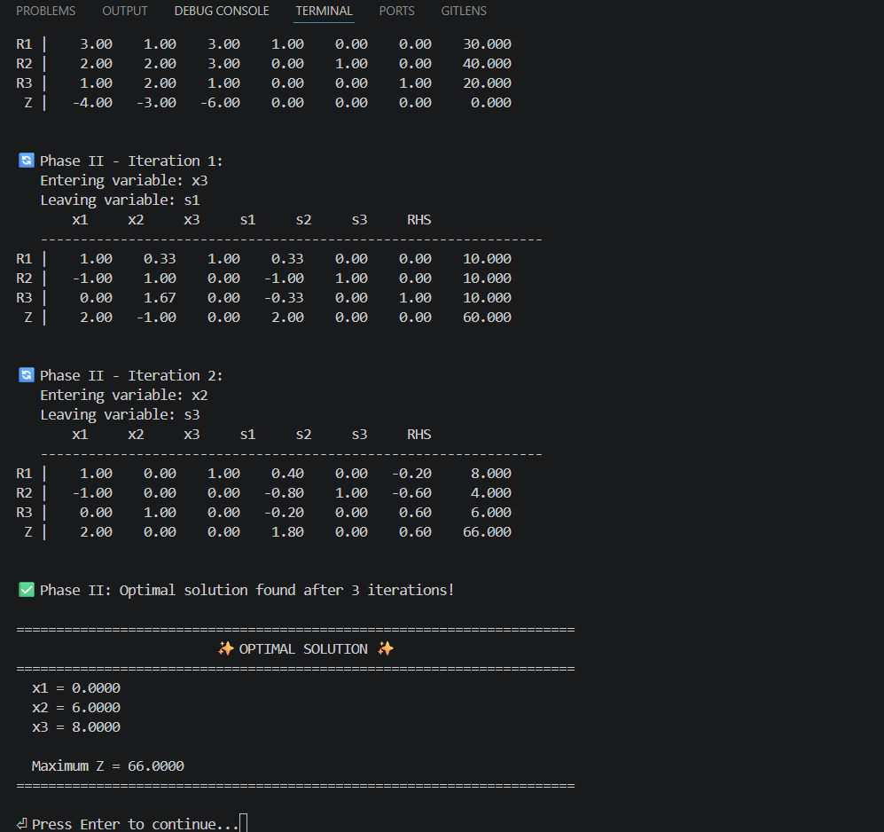

# Linear Programming Solver

A professional Python-based Linear Programming Solver implementing both the **Graphical Method** and the **Two-Phase Simplex Method** for solving optimization problems.

---

## 📌 Overview

This project was developed as part of the **Decision Support Systems** course.

The solver supports:

- Maximization and minimization problems
- Multiple constraint types (`<=`, `=`, `>=`)
- Graphical visualization for 2-variable problems
- Two-Phase Simplex Method for problems with any number of variables
- Step-by-step simplex tableau iterations

---

## ✨ Features

### 🔹 Graphical Method
- Solves LP problems with 2 variables
- Displays feasible region graphically
- Finds corner points automatically
- Highlights the optimal solution on the graph

### 🔹 Two-Phase Simplex Method
- Handles:
  - `<=` constraints
  - `>=` constraints
  - `=` constraints
- Supports both maximization and minimization
- Displays tableau iterations step-by-step
- Detects:
  - infeasible problems
  - unbounded solutions

### 🔹 Additional Features
- Interactive command-line interface
- Input validation
- Clean formatted output
- Built-in examples for testing

---

## 🛠️ Technologies Used

| Technology | Purpose |
|---|---|
| Python 3 | Core programming language |
| NumPy | Matrix operations and numerical computations |
| Matplotlib | Graph plotting and visualization |

---

# 📁 Project Structure

```text
linear-programming-solver/
│
├── main.py
├── simplex_solver.py
├── graphical_solver.py
├── utils.py
├── requirements.txt
├── README.md
├── .gitignore
│
├── examples/
│   ├── example1.txt
│   ├── example2.txt
│   ├── example3.txt
│   ├── example4.txt
│   └── example5.txt
│
├── screenshots/
│   ├── graphical_method.png
│   └── simplex_tableau.png
````

---

# 🚀 Installation & Usage

## 1️⃣ Clone the Repository

```bash
git clone https://github.com/Rawan-Arby/linear-programming-solver.git
cd linear-programming-solver
```

---

## 2️⃣ Install Dependencies

```bash
pip install -r requirements.txt
```

---

## 3️⃣ Run the Program

```bash
python main.py
```

---

# 📖 Example Problems

## Example 1 — Maximization Problem

### Objective Function

```text
Maximize Z = 3x1 + 5x2
```

### Constraints

```text
x1 <= 4
2x2 <= 12
3x1 + 2x2 <= 18
x1, x2 >= 0
```

### Expected Solution

```text
x1 = 2
x2 = 6
Z = 36
```

---

## Example 2 — Minimization Problem

### Objective Function

```text
Minimize Z = 4x1 + x2
```

### Constraints

```text
x1 + x2 >= 6
x1 <= 5
x2 <= 4
x1, x2 >= 0
```

### Expected Solution

```text
x1 = 2
x2 = 4
Z = 12
```

---

# 📊 Screenshots

## Graphical Method



---

## Simplex Tableau Iterations



---

# 🧠 Algorithms Implemented

## 🔹 Graphical Method

The graphical method:

* plots all constraints,
* identifies the feasible region,
* computes all corner points,
* evaluates the objective function at each vertex,
* and determines the optimal solution visually.

---

## 🔹 Two-Phase Simplex Method

### Phase I

* Introduces artificial variables
* Finds an initial feasible solution

### Phase II

* Optimizes the original objective function
* Performs pivot operations iteratively
* Reaches the optimal solution

---

# 📝 Input Format

For each constraint, enter:

```text
a1 a2 ... an b
```

Where:

```text
a1x1 + a2x2 + ... + anxn <= b
```

Example:

```text
2 1 3 30
```

Represents:

```text
2x1 + 1x2 + 3x3 <= 30
```

Type:

```text
done
```

when finished entering constraints.

---

# 🎓 Educational Purpose

This project was developed for educational purposes as part of the:

* Decision Support Systems Course
* Linear Programming & Optimization Studies

---

# 🙏 Acknowledgments

* Course instructor for guidance
* Open-source libraries:

  * NumPy
  * Matplotlib

```
